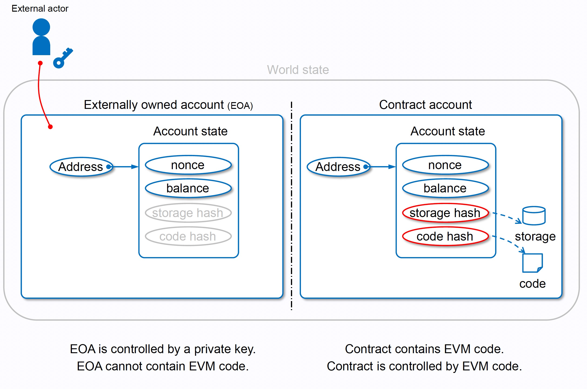

# 以太坊虚拟机（EVM）

### 从账本到状态机

通常使用“分布式账簿”的类比来描述像比特币这样的区块链，以太坊有自己的本机加密货币 (ETH)，遵循几乎完全相同的直观规则，但它也支持更强大的功能：智能合约。

对于此更复杂的功能，需要一个更复杂的类比：以太坊不是分布式账本，而是分布式状态机。

**分布式状态机：**

在以太坊的上下文中，状态是一个巨大的数据结构，称为调整后的 Merkle Patricia Trie，使所有帐户通过哈希链接，并可回溯到存储在区块链上的单个根哈希。

### 世界状态

世界状态是地址（账户）到账户状态的映射。虽然世界状态不保存在区块链上，但在黄皮书的描述中，世界状态也由树来保存数据（此树也被称为状态数据库或者状态树）。世界状态可以被视作为随着交易的执行而持续更新的全局状态。以太坊就像一个去中心化的计算机，世界状态则是这台电脑的硬盘。

### 账户状态

以太坊中有两种账户类型：外部所有账户（Externally Owned Accounts 简称 EOA）以及合约账户。我们用来互相收发以太币、部署智能合约的账户就是 EOA 账户，而部署智能合约时自动生成的账户则是合约账户。每一个智能合约都有其独一无二的以太坊账户。

以太坊帐户有四个字段：

- `nonce` – 显示从帐户发送的交易数量的计数器。 这将确保交易只处理一次。 在合约帐户中，这个数字代表该帐户创建的合约数量
- `balance` – 这个地址拥有的 Wei 数量。 Wei 是以太币的计数单位，每个 ETH 有 1e18 Wei。
- `codeHash` - 该哈希表示以太坊虚拟机 (EVM) 上的帐户代码。 合约帐户具有编程的代码片段，可以执行不同的操作。 如果帐户收到消息调用，则执行此 EVM 代码。 与其他帐户字段不同，不能更改。 所有代码片段都被保存在状态数据库的相应哈希下，供后续检索。 此哈希值称为 codeHash。 对于外部所有的帐户，codeHash 字段是空字符串的哈希。
- `storageRoot` – 有时被称为存储哈希。 Merkle Patricia trie 根节点的 256 位哈希已编码了帐户的存储内容（256 位整数值映射），并编码为 Trie，作为来自 256 的 Keccak 256 位哈希的映射位整数键，用于 RLP 编码的 256 位整数值。 此 Trie 对此帐户存储内容的哈希进行编码，默认情况下为空。

**账户结构：**

**账户存储树：**

**两种账户类型（EOA/Contract）：**

注意：**EOA账户地址是有私钥控制的，而合约账户的地址没有私钥**，原因是hash的方式不同：

### 智能合约调用

1. 编译合约代码，获取智能合约的ABI和字节码(bytecode)
2. 部署合约，传入智能合约的ABI和字节码(bytecode)，部署成功会改变Account State的codeHash和storageRoot的值并返回合约地址
3. 向合约地址发送消息，通过input data传参
4. 调用成功，Account State改变

在以太坊中有四种消息：

- EOA -> EOA，普通转账
- EOA -> Contract Account，用户调用合约
- Contract Account -> EOA，合约执行转账到外部账户
- Contract Account -> Contract Account，合约调用合约

### Ethereum Virtual Machine (EVM)

上图体现了智能合约的工作流程，EVM 作为一个堆栈机运行，其栈的深度为 1024 个元素。 每个元素都是 256 位字，为了便于使用，选择了 256 位加密技术（如 Keccak-256 哈希或 secp256k1 签名）。

在执行期间，EVM 会维护一个瞬态内存（作为可寻址的字节数组），该内存不会在交易之间持久存在。

然而，合约确实包含一个 Merkle Patricia 存储 trie（作为可寻址的字节数组），该 trie 与帐户和部分全局状态关联。

已编译的智能合约字节码作为许多 EVM opcodes 执行，它们执行标准的堆栈操作，例如 XOR、 AND、 ADD、SUB等。 EVM 还实现了一些区块链特定的堆栈操作，如 ADDRESS、BALANCE、BLOCKHASH 等：

- Stack，堆栈内存，可以放256 bits x 1024个元素，所有操作都在堆栈上执行，使用PUSH/POP/COPY/SWAP等多种指令访问。

- Memory，瞬态内存，内存是线性的，可以在字节级别寻址，使用 MSTORE/MSTORE8/MLOAD 指令访问，内存中的所有位置最初都明确定义为零。

- Storage，持久化内存，是将 256 位字映射到 256 位字的键值存储，使用 SSTORE/SLOAD 指令访问，内存中的所有位置最初都明确定义为零。

  
